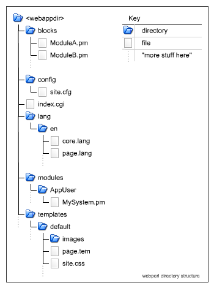

Web App Structure                                            {#appstructure}
=================

The framework assumes that a specific files and directories are present in
order to work correctly. Note that you can easily change these if you handle
the initialisation of the various modules in the framework yourself, but if
you use the Application module to handle all the setup for you, you must
follow the structure given in this documentation.

Structure overview
------------------

This diagram shows a typical web application's directory hierarchy. Notes
follow the diagram

<dl><dt>blocks</dt>
<dd>contains subclasses of Block that implement the actual functionality of
your web application. Further subdirectories may be present, if more complex
class hierarchies are needed. See the @ref blocks "Blocks" information for more details.</dd>
</dl>

<dl><dt>config</dt>
<dd>contains the global site.cfg file, protected by .htaccess. You can easily
place the configuration file outside the web tree if you want, by using the
`config` argument to Application::new(). See the @ref config "Configuration" information for
more about the config file, and how configuration information is stored and
passed to your Block implementations.</dd>
</dl>

<dl><dt>index.cgi</dt>
<dd>The front-end script for the application (or, potentially, one of them).
If you are using the Application class to handle all the framework setup for
you, this will usually contain very little code indeed - potentially only
the 6 lines shown in the Application documentation!</dd>
</dl>

<dl><dt>lang</dt>
<dd>has subdirectories containing language files.</dd>
</dl>
